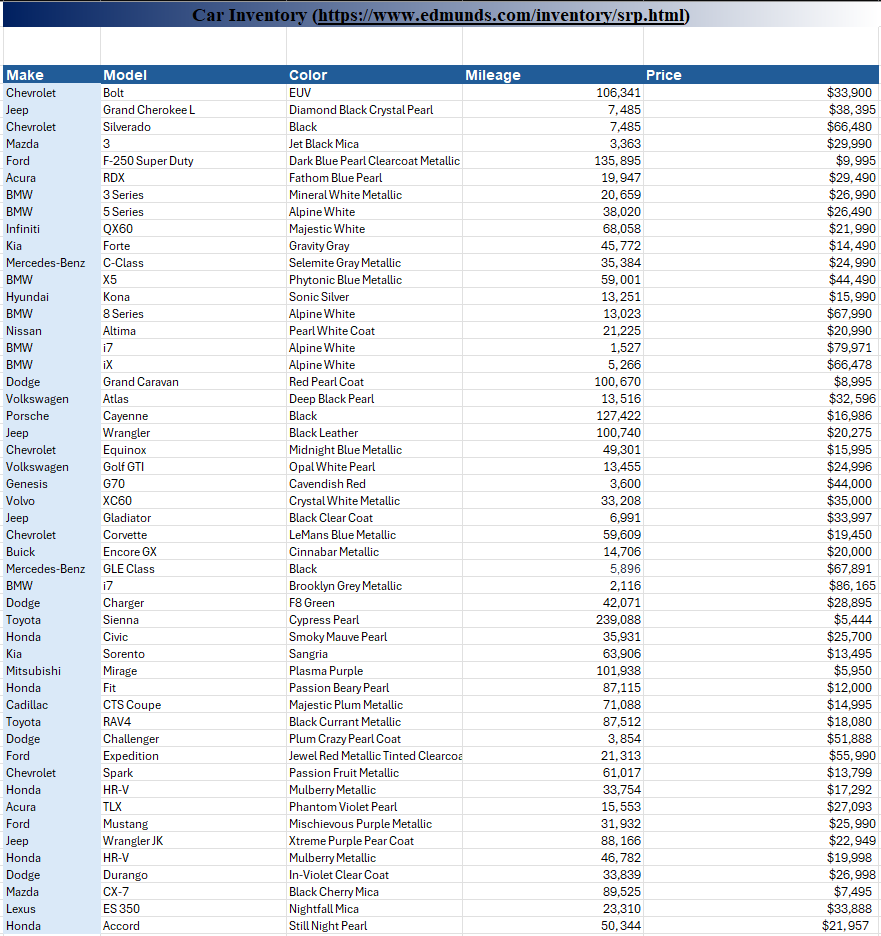

# README to Know More About the Car Inventory with Pivot Table Data Entry Project

## Project Description:

I researched and collected data from the website https://www.edmunds.com/inventory/srp.html on various Cars based on the following characteristics: "Make", "Model", "Color", "Mileage", and "Price". Then create a Pivot Table that contains "Make" representing the Car Brand and each of the "Models" under the "Make". The Columns in the Pivot Table computes the Grand Total for the total number of colored cars. The rows  compute the Grand Total for the total number of each "Make" car in bold and further break down the number of "Models".

## Skills Applied in This Project:

1. Microsoft Excel
2. Data Entry

## Website Reference:

1. https://www.edmunds.com/inventory/srp.html

## Screenshot Images Below Showing Car Inventory Data Entry Table and the Pivot Table Associated with the Car Inventory Data Entry Table:

